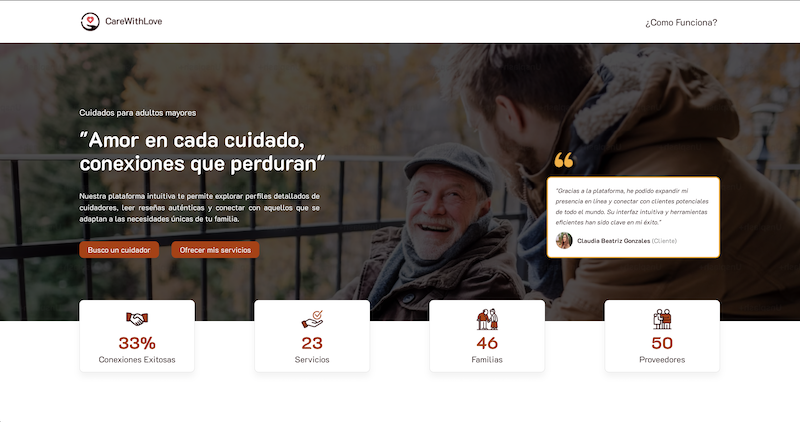
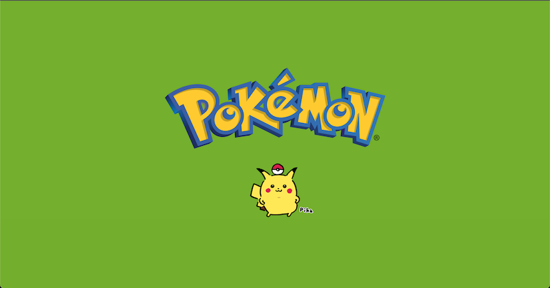

<h3 align="center" style="color: #007bff;">Jr. Front-end Web Developer | Senior Graphic Designer
</h3>

Desarrollador Full Stack y Diseñador Gráfico con más de 10 años de experiencia en la realización de piezas gráficas para medios impresos y digitales.

He participado en procesos creativos e investigativos, como coordinador de métodos etnográficos, director de arte y diseñador gráfico.

Mi experiencia como alpinista e instructor de escalada en roca, han desarrollado en mi habilidades como la resolución de problemas, comunicación efectiva, planificación y trabajo en equipo, competencias que tienen una gran relevancia y aplicabilidad en el entorno laboral.

 

[!IMPORTANT] <h4>Projects</h4>

<table>
    <tr>
        <td align="center">
            
            

                <h3 align="center">Care With love</h3>
                
Single Page Application que facilita la conexión entre cuidadores de adultos mayores y las familias que buscan este servicio. La plataforma ofrece un proceso de contratación intuitivo, en donde los cuidadores podrán ofrecer una amplia gama de servicios personalizados a su experiencia.

                <ul align="left">
                    <li>User view</li>
                    <li>Dashboard de Administración</li>
                    <li>API</li>
                </ul>                
                
Tecnologías implementadas

                <ul align="left">
                    <li>Lenguajes de Programación: JavaScript</li>
                    <li>Herramientas de Frameworks: React.js, Express.js</li>
                    <li>Base de Datos: PostgreSQL</li>
                    <li>Otras tecnologías: Vite, Node.js, SASS, Redux, Axios</li>
                </ul>
                
Funciones: Front-end developer

                
Proyecto realizado con un equipo de 8 Integrantes

                <ul align="left">
                    <li><a href="https://github.com/pablo0261">Pablo Besler</a></li>
                    <li><a href="https://github.com/AFunesAbdala">Alejo Funes Abdala</a></li>
                    <li><a href="https://github.com/leandroh1002">Leandro Herrera</a></li>
                    <li><a href="https://github.com/tiago1820">Tiago de Oliveira</a></li>
                    <li><a href="https://github.com/LinxInformatica">Diego Lepore</a></li>
                    <li><a href="https://github.com/EmmanuelMarne">Emmanuel Martinez</a></li>
                </ul>
                
<a href="https://proyecto-final-front-ashy.vercel.app/">Despliegue del proyecto</a>

            

        </td>
        <td align="center">
            
            

                <h3 align="center">Pokemon</h3>
                
Single Page Application realiza solicitudes a una API a través de un servidor y renderiza la información de los diferentes personajes de Pokemon en tarjetas.

                
Tecnologías implementadas

                <ul align="left">
                    <li>Lenguajes de Programación: JavaScript</li>
                    <li>Herramientas de Frameworks: React.js, Express.js</li>
                    <li>Base de Datos: PostgreSQL</li>
                    <li>Otras tecnologías: Vite, Node.js, Redux, Axios</li>
                </ul>
                
Funciones: Front-end y Back-end developer

                
Proyecto individual

                
<a href="#">Despliegue del proyecto</a>

            

        </td>
    </tr>
</table>

 

<table>
        <tr>
            <td align="center"></td>
            <td></td>
            <td></td>
            <td></td>
            <td></td>
            <td></td>
            <td></td>
        </tr>
        <tr>
            <td></td>
            <td></td>
            <td></td>
            <td></td>
            <td></td>
            <td> </td>
            <td></td>
        </tr>
    </table>

 

